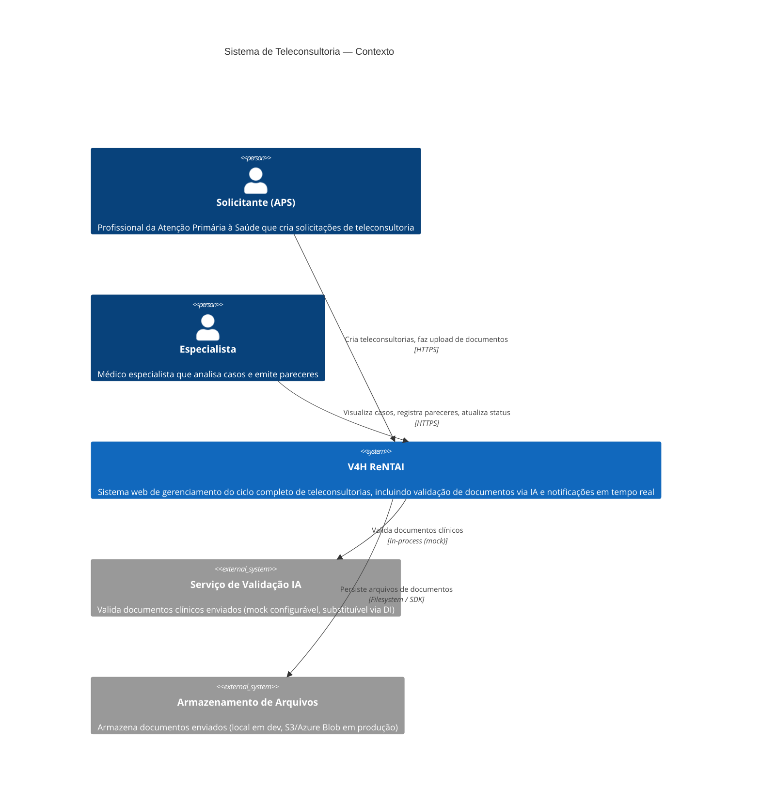
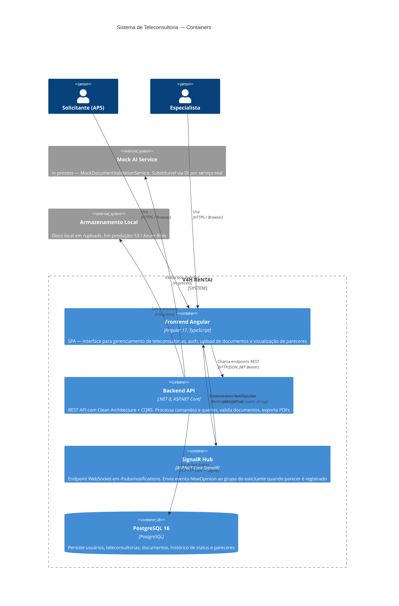
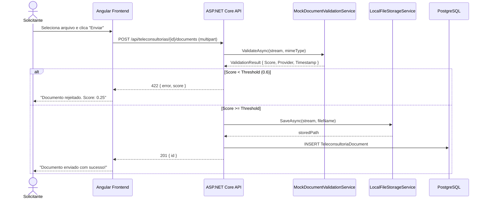
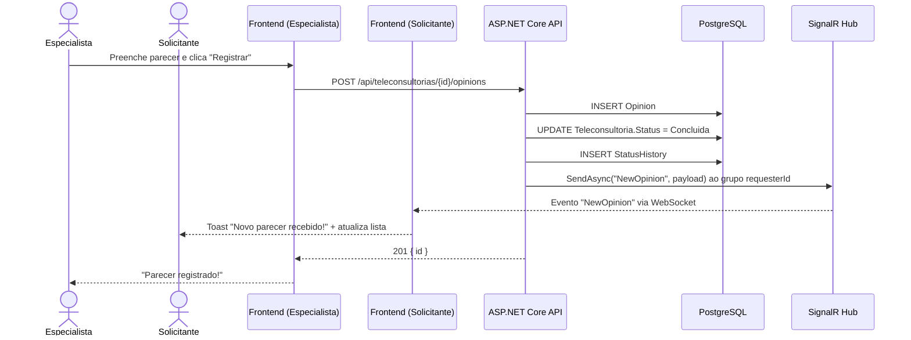

# C4 Diagrams — V4H ReNTAI Teleconsultoria

Diagramas usando notação C4 com sintaxe Mermaid (renderizável no GitHub).

---

## Nível 1 — Contexto do Sistema

---

## Nível 2 — Containers

---

## Fluxo: Upload + Validação IA

---

## Fluxo: Parecer + Notificação em Tempo Real

