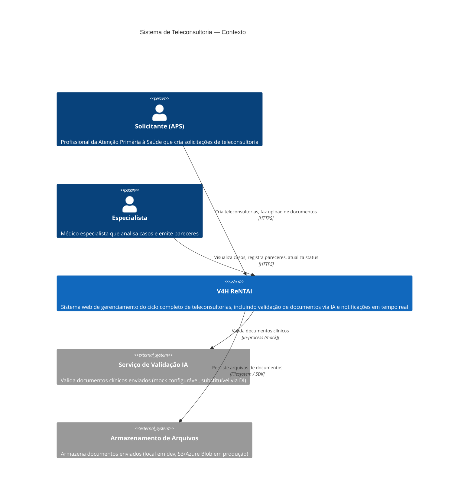
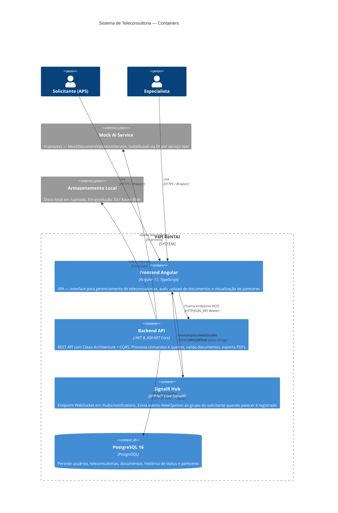
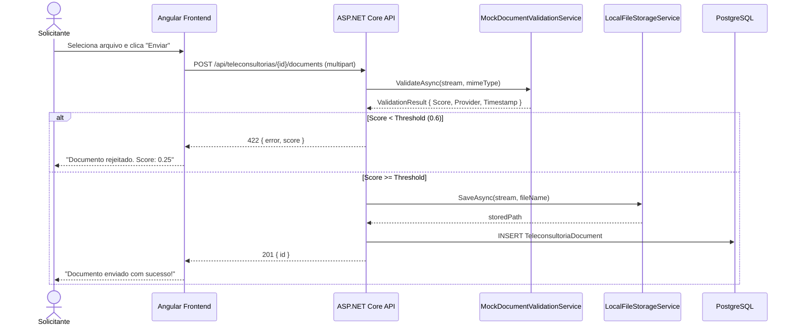
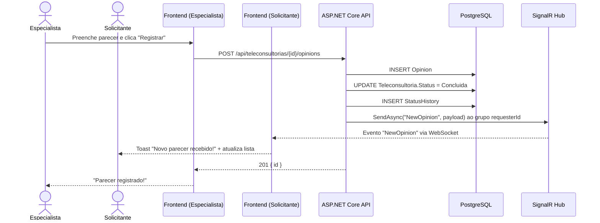

# Teleconsultoria — Plan 3: Docs (ADRs + C4 + README)

> **For agentic workers:** REQUIRED SUB-SKILL: Use superpowers:subagent-driven-development (recommended) or superpowers:executing-plans to implement this plan task-by-task. Steps use checkbox (`- [ ]`) syntax for tracking.

**Goal:** Produce all required project documentation — 6 Architecture Decision Records, C4 diagrams (Context + Containers), and a complete README with setup instructions and mandatory AI tools declaration.

**Architecture:** Static Markdown docs committed to `docs/`. C4 diagrams use Mermaid syntax (renderable on GitHub). ADRs follow the MADR lightweight format.

**Tech Stack:** Markdown, Mermaid

---

## File Map

```
docs/
├── adr/
│   ├── ADR-001-clean-architecture.md
│   ├── ADR-002-cqrs-mediatr.md
│   ├── ADR-003-jwt-authentication.md
│   ├── ADR-004-signalr-realtime.md
│   ├── ADR-005-mock-ai-service.md
│   └── ADR-006-questpdf.md
└── c4/
    └── diagrams.md
README.md
```

---

### Task 1: Architecture Decision Records

**Files:**
- Create: `docs/adr/ADR-001-clean-architecture.md`
- Create: `docs/adr/ADR-002-cqrs-mediatr.md`
- Create: `docs/adr/ADR-003-jwt-authentication.md`
- Create: `docs/adr/ADR-004-signalr-realtime.md`
- Create: `docs/adr/ADR-005-mock-ai-service.md`
- Create: `docs/adr/ADR-006-questpdf.md`

- [ ] **Step 1: Write ADR-001**

`docs/adr/ADR-001-clean-architecture.md`:
```markdown
# ADR-001: Clean Architecture como estrutura do backend

**Data:** 2026-05-21  
**Status:** Aceito

## Contexto

O sistema de teleconsultoria requer separação clara de responsabilidades entre regras de negócio, casos de uso e detalhes de infraestrutura. O time de avaliação espera maturidade arquitetural e código testável de forma isolada.

## Decisão

Adotar Clean Architecture com quatro projetos:

| Projeto | Responsabilidade |
|---------|-----------------|
| `V4H.Domain` | Entidades, enums, interfaces de repositório |
| `V4H.Application` | Casos de uso (CQRS), DTOs, interfaces de portas |
| `V4H.Infrastructure` | EF Core, repositórios, serviços externos |
| `V4H.API` | Controllers, middleware, configuração DI |

**Regra de dependência:** `Domain ← Application ← Infrastructure → API`. API depende de Application e Infrastructure via DI.

## Consequências

**Positivo:**
- Regras de negócio testáveis sem banco de dados (mocks via NSubstitute)
- Infraestrutura substituível (banco, AI, storage) sem alterar Application
- Estrutura familiar para times .NET com experiência em DDD

**Negativo:**
- Mais projetos e arquivos comparado a uma estrutura simples (MVC monolítico)
- Overhead inicial de setup; justificado pelo escopo do desafio

## Alternativas Consideradas

- **MVC monolítico:** mais rápido para protótipos, mas dificulta testes e separação de responsabilidades
- **Vertical Slice Architecture:** excelente para equipes maiores, mas overhead desnecessário para escopo único de entrega
```

- [ ] **Step 2: Write ADR-002**

`docs/adr/ADR-002-cqrs-mediatr.md`:
```markdown
# ADR-002: CQRS via MediatR

**Data:** 2026-05-21  
**Status:** Aceito

## Contexto

Os casos de uso do sistema têm naturezas diferentes: criação/upload/opiniões (comandos que modificam estado) e listagem/detalhes/exportação (consultas somente-leitura). Misturar essas responsabilidades em services genéricos dificulta testes e evolução.

## Decisão

Usar o padrão CQRS com a biblioteca MediatR:

- **Commands:** `RegisterCommand`, `CreateTeleconsultoriaCommand`, `UploadDocumentCommand`, `RegisterOpinionCommand`, `UpdateStatusCommand`
- **Queries:** `ListTeleconsultoriasQuery`, `GetTeleconsultoriaDetailQuery`, `ExportPdfQuery`

Cada handler é uma classe com responsabilidade única, injetada via MediatR no pipeline.

## Consequências

**Positivo:**
- Cada caso de uso é um handler isolado — testável individualmente com mocks
- Nenhum "service" genérico com dezenas de métodos
- Pipeline do MediatR permite adicionar behaviors (logging, validação) de forma transversal

**Negativo:**
- Proliferação de classes (um arquivo por comando/query); aceitável para o escopo
- Curva de aprendizado para desenvolvedores sem experiência com MediatR

## Alternativas Consideradas

- **Application Services tradicionais:** uma interface por agregado; resulta em classes grandes e dificulta cobertura de testes
- **CQRS com barramentos externos (NServiceBus):** overkill para a escala deste projeto
```

- [ ] **Step 3: Write ADR-003**

`docs/adr/ADR-003-jwt-authentication.md`:
```markdown
# ADR-003: JWT para autenticação

**Data:** 2026-05-21  
**Status:** Aceito

## Contexto

O sistema tem dois perfis de usuário (Solicitante e Especialista) com permissões distintas nos endpoints. É necessário um mecanismo de autenticação stateless, compatível com o frontend Angular e com o hub SignalR.

## Decisão

Usar JWT (JSON Web Tokens) com:

- **Algoritmo:** HMAC-SHA256 (HS256) — simétrico, sem necessidade de infraestrutura PKI
- **Expiração:** 8 horas
- **Claims:** `sub` (userId), `email`, `role` (Solicitante | Especialista)
- **Secret:** variável de ambiente `JWT__Secret` (mínimo 32 caracteres)
- **Senha:** BCrypt com cost factor 12 (protege contra força bruta offline)
- **Angular:** `AuthInterceptor` injeta `Authorization: Bearer <token>` em todas as requisições
- **SignalR:** token passado via query string `access_token` para o handshake WebSocket

## Consequências

**Positivo:**
- Stateless — sem estado de sessão no servidor
- Nativo no ASP.NET Core com `Microsoft.AspNetCore.Authentication.JwtBearer`
- Claims com role permitem `[Authorize(Roles="Solicitante")]` nos controllers

**Negativo:**
- Sem refresh token — sessão expira em 8h (aceitável para o escopo)
- Token revogação requer lista negra (não implementado — fora de escopo)

## Alternativas Consideradas

- **Cookies de sessão:** stateful, requer session store; problemático com SignalR e CORS
- **OAuth2/OIDC (Keycloak):** robusto para produção, mas overhead de setup inviável para o prazo
```

- [ ] **Step 4: Write ADR-004**

`docs/adr/ADR-004-signalr-realtime.md`:
```markdown
# ADR-004: SignalR para notificações em tempo real

**Data:** 2026-05-21  
**Status:** Aceito

## Contexto

Quando um Especialista registra um parecer, o Solicitante que criou a teleconsultoria deve ser notificado imediatamente, sem necessidade de recarregar a página.

## Decisão

Usar SignalR (ASP.NET Core) para notificações push:

- **Hub:** `NotificationHub` em `/hubs/notifications`
- **Grupos:** cada usuário entra no grupo identificado pelo seu `userId` ao conectar
- **Evento:** `NewOpinion` — enviado ao grupo do `requesterId` com `{ teleconsultoriaId, opinionId }`
- **Cliente:** `@microsoft/signalr` no Angular; `NotificationService` gerencia conexão e expõe `lastOpinionNotification` como Signal do Angular
- **Reconexão automática:** `withAutomaticReconnect()` no builder do cliente

## Consequências

**Positivo:**
- Nativo no ecossistema ASP.NET Core — sem broker externo (Redis, RabbitMQ)
- Fallback automático (WebSocket → Server-Sent Events → Long Polling)
- Angular Signals integram naturalmente com o padrão reativo do frontend

**Negativo:**
- Sem persistência de notificações perdidas (usuário desconectado não recupera eventos)
- Em produção com múltiplas instâncias, requereria Redis backplane

## Alternativas Consideradas

- **Polling:** simples de implementar, mas desperdiça banda e introduz latência
- **Server-Sent Events (SSE):** unidirecional; SignalR oferece bidirecionalidade e fallbacks
- **WebSockets puros:** requer implementação manual de reconexão e protocolo
```

- [ ] **Step 5: Write ADR-005**

`docs/adr/ADR-005-mock-ai-service.md`:
```markdown
# ADR-005: Serviço de IA como mock com interface real

**Data:** 2026-05-21  
**Status:** Aceito

## Contexto

O edital exige integração com validação de documentos via IA. Não existe uma API de IA disponibilizada pelo projeto; integração com serviços externos (OpenAI, AWS Rekognition) está fora do escopo do prazo.

## Decisão

Definir a interface `IDocumentValidationService` na camada Application e implementar um mock configurável na camada Infrastructure:

```csharp
public interface IDocumentValidationService
{
    Task<ValidationResult> ValidateAsync(Stream file, string mimeType, CancellationToken ct = default);
}

public record ValidationResult(decimal Score, string Provider, DateTimeOffset Timestamp);
```

**Comportamento do mock:**
- `AI__MockScore` configurado → retorna score fixo (útil para testes)
- Sem configuração → score por mimeType: PDF → 0.92, JPEG/PNG → 0.78, outros → 0.25
- Threshold configurável via `AI__ValidationThreshold` (padrão 0.6)
- Score abaixo do threshold → `DocumentValidationException` → HTTP 422 com score

**Substituição:** trocar `MockDocumentValidationService` por implementação real não requer alteração em Application ou API — apenas o registro no DI Container.

## Consequências

**Positivo:**
- Demonstra design correto de inversão de dependência
- Testável: handlers testados com `IDocumentValidationService` mockado via NSubstitute
- Produção-ready: um `RealDocumentValidationService` pode ser injetado sem refatoração

**Negativo:**
- Não valida conteúdo real dos documentos (intencional)

## Alternativas Consideradas

- **Integração direta com OpenAI Vision:** requer chave de API paga e adiciona latência; fora de escopo
- **Hardcode do score:** impossível testar casos de rejeição e aprovação separadamente
```

- [ ] **Step 6: Write ADR-006**

`docs/adr/ADR-006-questpdf.md`:
```markdown
# ADR-006: QuestPDF para exportação de PDF

**Data:** 2026-05-21  
**Status:** Aceito

## Contexto

O sistema deve exportar detalhes de uma teleconsultoria (dados do paciente, hipótese diagnóstica, histórico clínico, pareceres) em formato PDF para download.

## Decisão

Usar a biblioteca **QuestPDF** (licença Community — gratuita para projetos não comerciais):

- Geração de PDF em memória (`byte[]`) via Fluent API
- Sem dependência de libgdiplus, Ghostscript ou headless browser
- Implementado em `QuestPdfExportService : IPdfExportService`
- `IPdfExportService` definida na camada Application (porta); implementação na Infrastructure

## Consequências

**Positivo:**
- API fluente e legível — layout declarativo similar a CSS Flexbox
- Licença Community adequada para ambiente acadêmico/avaliativo
- Sem dependências nativas — funciona em Linux/Docker sem libgdiplus

**Negativo:**
- Curva de aprendizado para layouts complexos (tabelas, imagens embutidas)
- Layout atual é simples; relatórios mais ricos requerem mais código de layout

## Alternativas Consideradas

- **iTextSharp/iText7:** licença AGPL obriga abertura do código ou licença comercial paga
- **PdfSharp:** boa opção open source, mas API de baixo nível mais verbosa
- **Puppeteer (headless Chrome):** flexível para layouts HTML→PDF, mas adiciona dependência pesada de Node.js/Chrome no container
```

- [ ] **Step 7: Commit ADRs**

```bash
cd C:\Users\joaom\Dev\v4h-rentai
git add docs/adr/
git commit -m "docs: add 6 Architecture Decision Records (ADR-001 to ADR-006)"
```

---

### Task 2: C4 Diagrams

**Files:**
- Create: `docs/c4/diagrams.md`

- [ ] **Step 1: Write C4 diagrams document**

`docs/c4/diagrams.md`:
````markdown
# C4 Diagrams — V4H ReNTAI Teleconsultoria

Diagramas usando notação C4 com sintaxe Mermaid (renderizável no GitHub).

---

## Nível 1 — Contexto do Sistema



---

## Nível 2 — Containers



---

## Fluxos Chave

### Upload + Validação IA



### Parecer + Notificação em Tempo Real


````

- [ ] **Step 2: Commit C4 diagrams**

```bash
cd C:\Users\joaom\Dev\v4h-rentai
git add docs/c4/
git commit -m "docs: C4 diagrams (Context, Containers) and sequence diagrams in Mermaid"
```

---

### Task 3: README

**Files:**
- Modify: `README.md` (create if not exists)

- [ ] **Step 1: Write README**

`README.md`:
````markdown
# V4H ReNTAI — Módulo de Teleconsultoria

Sistema web para gerenciamento do ciclo completo de teleconsultorias no projeto ReNTAI/V4H da UFPB LAVID. Desenvolvido como desafio técnico para processo seletivo.

## Funcionalidades

- **Autenticação** — Registro e login com dois perfis: Solicitante (APS) e Especialista
- **Gestão de Teleconsultorias** — CRUD completo com filtros por especialidade, paciente, status e data
- **Upload de Documentos com IA** — Validação automática via `IDocumentValidationService` (mock configurável, substituível via DI)
- **Pareceres** — Especialistas registram pareceres clínicos; status atualizado automaticamente para Concluída
- **Notificações em Tempo Real** — SignalR notifica o Solicitante quando um parecer é registrado
- **Exportação PDF** — Download do relatório completo via QuestPDF

## Stack

| Camada | Tecnologia |
|--------|-----------|
| Backend | .NET 8, ASP.NET Core, EF Core 8 |
| Frontend | Angular 17 (standalone components) |
| Banco | PostgreSQL 16 |
| Real-time | SignalR |
| Auth | JWT HS256, BCrypt cost-12 |
| AI (Mock) | `IDocumentValidationService` — PDF 0.92, JPEG/PNG 0.78, outros 0.25 |
| PDF Export | QuestPDF |
| Testes | xUnit, NSubstitute, WebApplicationFactory, Jasmine |
| Container | Docker Compose |

## Arquitetura

Clean Architecture com 4 camadas no backend:

```
V4H.Domain → V4H.Application → V4H.Infrastructure → V4H.API
```

Ver [ADRs](docs/adr/) e [diagramas C4](docs/c4/diagrams.md) para decisões arquiteturais detalhadas.

## Pré-requisitos

- [.NET 8 SDK](https://dotnet.microsoft.com/download/dotnet/8)
- [Node.js 20+](https://nodejs.org/) e npm
- [Docker Desktop](https://www.docker.com/products/docker-desktop)

## Rodando Localmente

### 1. Configurar variáveis de ambiente

```bash
cp .env.example .env
# Edite .env e defina JWT_SECRET com ao menos 32 caracteres
```

### 2. Subir banco de dados

```bash
docker compose up db -d
```

### 3. Rodar o backend

```bash
cd backend
dotnet run --project src/V4H.API
```

A API estará em `http://localhost:5000`. Swagger disponível em `http://localhost:5000/swagger`.

As migrations são aplicadas automaticamente na inicialização.

### 4. Rodar o frontend

```bash
cd frontend
npm install
npx ng serve
```

O frontend estará em `http://localhost:4200`.

### 5. Subir tudo com Docker Compose

```bash
docker compose up --build
```

## Rodando Testes

### Backend

```bash
cd backend
dotnet test
```

Testes unitários (handlers Application) e integração (endpoints API com banco in-memory).

### Frontend

```bash
cd frontend
npx ng test --watch=false --browsers=ChromeHeadless
```

## Variáveis de Ambiente

| Variável | Descrição | Padrão |
|----------|-----------|--------|
| `ConnectionStrings__Default` | Connection string PostgreSQL | — |
| `JWT__Secret` | Secret para assinar JWT (≥32 chars) | — |
| `AI__ValidationThreshold` | Score mínimo para aprovação de documento | `0.6` |
| `AI__MockScore` | Se definido, sobrepõe o score calculado por mimeType | — |
| `Storage__BasePath` | Diretório local para upload de arquivos | `uploads` |

## Endpoints da API

```
POST   /api/auth/register
POST   /api/auth/login

GET    /api/teleconsultorias                      (query: specialty, patient, status, dateFrom, dateTo)
POST   /api/teleconsultorias                      [Solicitante]
GET    /api/teleconsultorias/{id}
PUT    /api/teleconsultorias/{id}/status          [Especialista]
POST   /api/teleconsultorias/{id}/documents       [Solicitante]
POST   /api/teleconsultorias/{id}/opinions        [Especialista]
GET    /api/teleconsultorias/{id}/export/pdf

WS     /hubs/notifications                        (evento: NewOpinion)
```

## Documentação

- [ADR-001: Clean Architecture](docs/adr/ADR-001-clean-architecture.md)
- [ADR-002: CQRS via MediatR](docs/adr/ADR-002-cqrs-mediatr.md)
- [ADR-003: JWT Authentication](docs/adr/ADR-003-jwt-authentication.md)
- [ADR-004: SignalR Real-time](docs/adr/ADR-004-signalr-realtime.md)
- [ADR-005: Mock AI Service](docs/adr/ADR-005-mock-ai-service.md)
- [ADR-006: QuestPDF](docs/adr/ADR-006-questpdf.md)
- [Diagramas C4 (Mermaid)](docs/c4/diagrams.md)
- [Design Spec](docs/superpowers/specs/2026-05-21-teleconsultoria-design.md)

## Uso de Ferramentas de IA

**Declaração obrigatória conforme requisito do processo seletivo:**

Este projeto foi desenvolvido com assistência ativa do **Claude Code** (Anthropic, modelo `claude-sonnet-4-6`) como ferramenta de desenvolvimento.

### Como a IA foi utilizada

| Fase | Uso |
|------|-----|
| **Brainstorming** | Levantamento de requisitos, escolha de stack (.NET 8 + Angular 17), definição de arquitetura (Clean Architecture + CQRS), decisão sobre mock AI service |
| **Design** | Produção do design spec com modelo de dados, contratos de API, fluxos de dados, fluxo de auth |
| **Planejamento** | Geração dos planos de implementação segregados (backend, frontend, docs) com tasks, steps e código completo |
| **Implementação** | Scaffolding de todos os arquivos de código (entidades, handlers, repositórios, serviços, controllers, componentes Angular) com verificação passo a passo |
| **Testes** | Escrita de testes unitários (NSubstitute) e integração (WebApplicationFactory), identificação de casos de borda (score abaixo do threshold, requester errado) |
| **Documentação** | Redação dos ADRs, diagramas C4 em Mermaid, README |

### Postura durante o uso

- Todas as decisões arquiteturais foram tomadas em colaboração, com explicação dos trade-offs
- O código gerado foi revisado e validado em cada passo antes de avançar
- A IA foi usada como par de programação sênior, não como caixa-preta
- O processo seguiu práticas de spec-driven development, contract-first e TDD

### Ferramentas utilizadas

- **Claude Code** (claude.ai/code) — ferramenta principal de desenvolvimento
- **Superpowers Plugin** — skills de brainstorming, writing-plans, executing-plans para estruturar o fluxo de trabalho com IA

## Limitações Conhecidas

- Arquivos salvos em disco local — em produção usaria S3/Azure Blob
- JWT sem refresh token — sessão expira em 8h
- Mock AI sem análise real de conteúdo — substituível via DI sem refatoração
- Sem rate limiting — necessário em produção
- SignalR sem Redis backplane — requerido para múltiplas instâncias

## Licença

Projeto desenvolvido para fins avaliativos — LAVID/UFPB ReNTAI, 2026.
````

- [ ] **Step 2: Commit README**

```bash
cd C:\Users\joaom\Dev\v4h-rentai
git add README.md
git commit -m "docs: complete README with setup, API reference, and mandatory AI tools declaration"
```

- [ ] **Step 3: Final verification**

```bash
# Verify all files present
Get-ChildItem docs/adr/ | Measure-Object  # Should be 6
Get-ChildItem docs/c4/   # Should have diagrams.md
Test-Path README.md       # Should be True

# Verify git log looks clean
git log --oneline -15
```

Expected log shows clean progression:
```
docs: complete README with setup, API reference, and mandatory AI tools declaration
docs: C4 diagrams (Context, Containers) and sequence diagrams in Mermaid
docs: add 6 Architecture Decision Records (ADR-001 to ADR-006)
feat(frontend): complete Angular 17 frontend — all features verified
...
chore: backend solution scaffold with NuGet packages
chore: initial commit with gitignore
```
